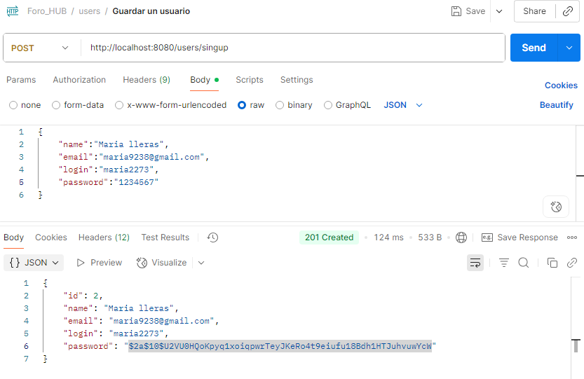
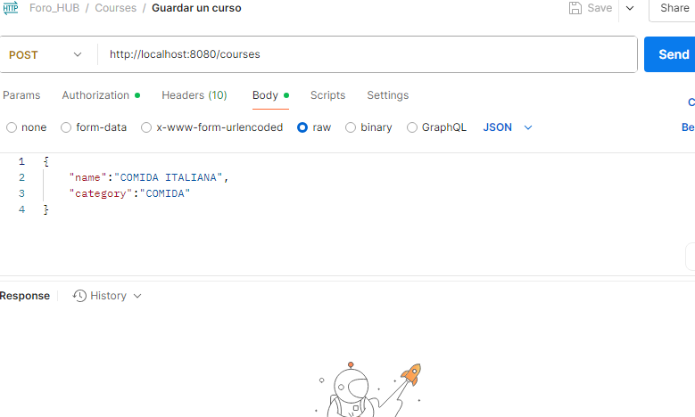
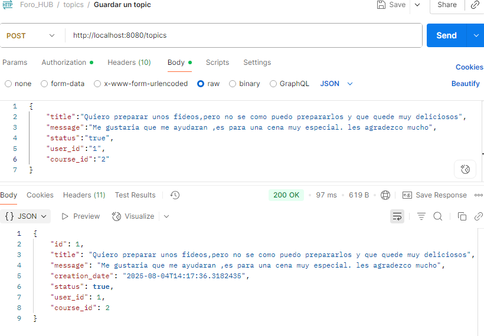
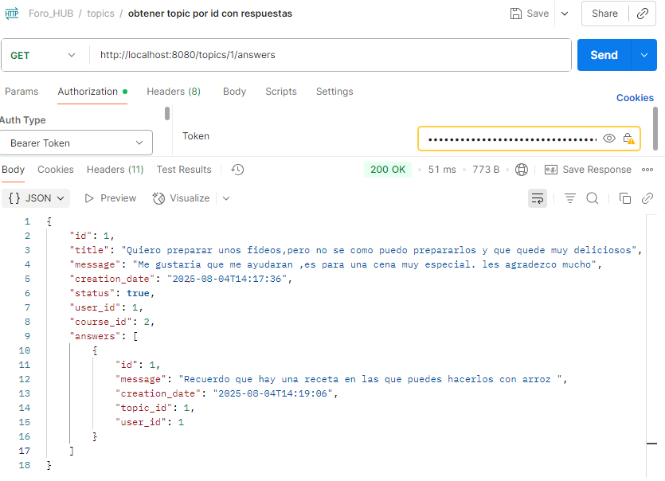

# Foro Hub API

Proyecto de una API REST para la gestión de un foro de discusión, desarrollado con **Spring Boot**, aplicando principios de **Programación Orientada a Objetos (POO)**, **Spring Security**, **JWT** y **SpringDoc** para documentación interactiva.

---

## 📚 Índice

- [🚀 Tecnologías utilizadas](#-tecnologías-utilizadas)
- [📌 Descripción del proyecto](#-descripción-del-proyecto)
- [🧠 Estructura de la base de datos](#-estructura-de-la-base-de-datos)
- [🔧 Funcionalidades principales](#-funcionalidades-principales)
- [🔐 Seguridad](#-seguridad)
- [📄 Documentación (Swagger)](#-documentación-swagger)

---

## 🚀 Tecnologías utilizadas

- Spring Boot
- Spring Security
- JWT (JSON Web Tokens)
- SpringDoc OpenAPI (Swagger)
- JPA / Hibernate
- MySQL
- BCrypt (para encriptación de contraseñas)

---

## 📌 Descripción del proyecto

Foro Hub es una API REST que permite:

- Crear temas de discusión (tópicos).
- Recibir respuestas de otros usuarios (actualmente no permite respuestas anidadas).
- Crear cursos o temáticas para organizar los tópicos y facilitar su búsqueda.
- Realizar operaciones CRUD sobre:
  - Usuarios
  - Cursos
  - Tópicos
  - Respuestas

Esta estructura permite que un usuario pueda navegar fácilmente por los temas de interés y encontrar dudas similares a las suyas.

---

## 🔧 Funcionalidades principales

A continuación, se muestran ejemplos de peticiones HTTP realizadas con Postman:

- ✅ Guardar usuario  
  _  
- ✅ Guardar curso  
   _  
- ✅ Guardar tópico  
   _    
- ✅ Guardar respuesta  
   _    
- ✅ Obtener tópico con sus respectivas respuestas  
   _    

---
## 🧠 Estructura de la base de datos

A continuación se muestra un diagrama con la estructura de la base de datos utilizada en el proyecto:

_ 

---

## 🔐 Seguridad

La seguridad está implementada con **Spring Security** y se basa en los siguientes principios:

- 🔒 Todas las peticiones HTTP están protegidas por defecto.
- 🔑 Autenticación mediante **JWT** (Bearer Token).
- ❌ No se usan cookies (la aplicación es **stateless**).
- 🔐 Contraseñas encriptadas con **BCrypt** antes de ser almacenadas en la base de datos, para evitar vulnerabilidades por contraseñas planas.

> En una versión con front-end integrado, se podría implementar un enfoque **stateful** con cookies seguras.

---

## 📄 Documentación (Swagger)

La documentación de la API está disponible gracias a **SpringDoc**, accesible desde:
http://localhost:8080/swagger-ui/index.html

---

### ⚠️ Importante:

- Para probar los endpoints protegidos, necesitas un **token JWT válido**.
- Una vez autenticado, incluye el token en el campo **Authorize** de Swagger como:

